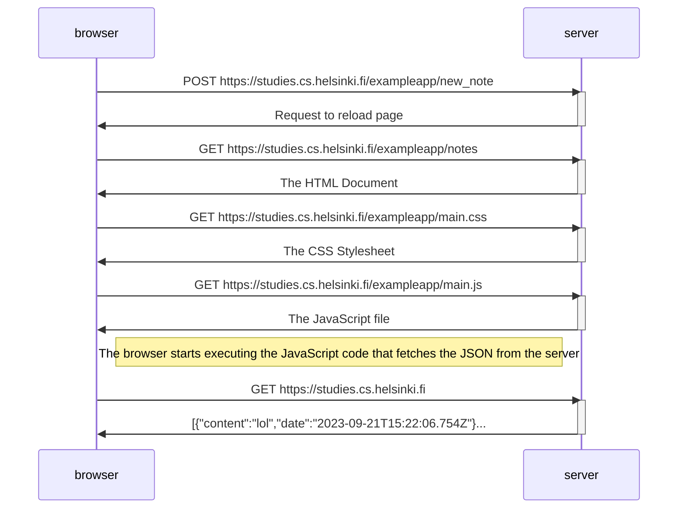

```mermaid
sequenceDiagram
  participant browser
  participant server

  browser->>server:	POST https://studies.cs.helsinki.fi/exampleapp/new_note
  activate server
  server->>browser: Request to reload page
  deactivate server

  browser->>server: GET https://studies.cs.helsinki.fi/exampleapp/notes
  activate server
  server->>browser: The HTML Document
  deactivate server

  browser->>server: GET https://studies.cs.helsinki.fi/exampleapp/main.css
  activate server
  server->>browser: The CSS Stylesheet
  deactivate server;

  browser->>server: GET https://studies.cs.helsinki.fi/exampleapp/main.js
  activate server
  server->>browser: The JavaScript file
  deactivate server;
  Note right of browser: The browser starts executing the JavaScript code that fetches the JSON from the server

  browser->>server: GET https://studies.cs.helsinki.fi
  activate server
  server->>browser: [{"content":"lol","date":"2023-09-21T15:22:06.754Z"}...
  deactivate server;

  
  
  
```
