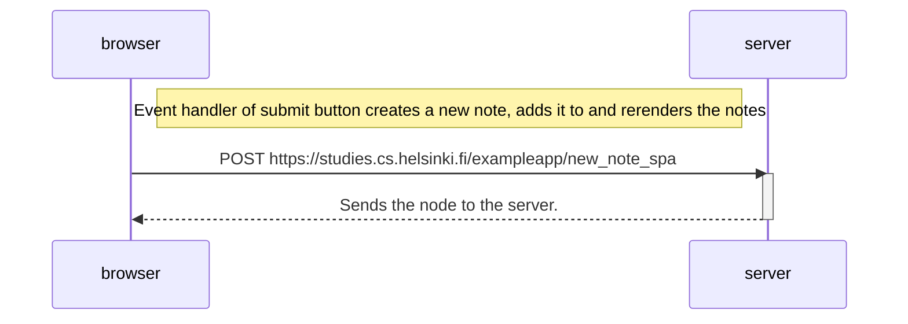

## Exercise 0.6

```mermaid
sequenceDiagram
    participant browser
    participant server

    Note right of browser: Event handler of submit button creates a new note, adds it to and rerenders the notes

    browser->>server: POST https://studies.cs.helsinki.fi/exampleapp/new_note_spa
    activate server
    server-->>browser: Sends the node to the server.
    deactivate server
```

    
